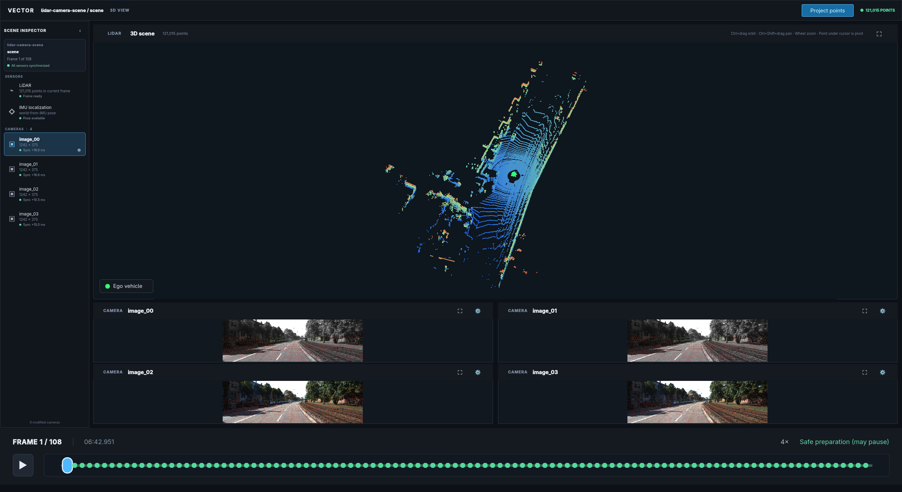
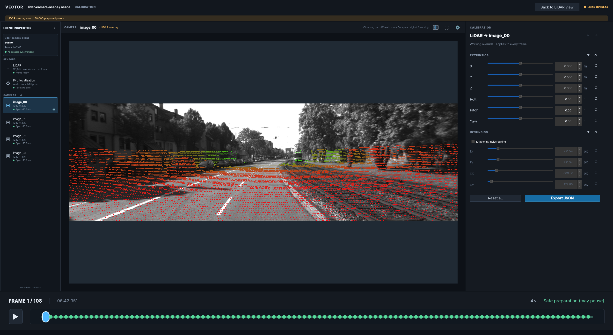

# LiDAR Camera Calibrator

**Manually refine static LiDAR-to-camera calibration with the data you already have.**

LiDAR Camera Calibrator is an open-source PySide6 package for manually refining static LiDAR-to-camera calibration. It provides synchronized playback, a navigable 3D point-cloud view, projected camera overlays, arbitrary-camera calibration, and direction-explicit JSON results.

It is intended for the practical work after a vehicle rig has been assembled: tightening alignment for labeling, validating a sensor setup, investigating a new calibration hypothesis, or experimenting with a different projection. Because vehicle rigs often remain stable for long periods, a deliberate manual refinement pass can be useful when an automatic calibration is unavailable or does not meet the precision needed for a workflow.





## Use any dataset

The package accepts semantic sensor data, not a particular vehicle dataset or directory layout. Your data can come from raw/proprietary files, Python and NumPy arrays, a custom lazy loader, or a supported standard Foxglove MCAP recording. KITTI is available as an optional, tested example pipeline.

The generic integration boundary is:

- timestamped LiDAR point clouds;
- one or more timestamped camera streams;
- camera intrinsics and image dimensions;
- a connected, acyclic transform path from every sensor to IMU;
- timestamped world-from-IMU poses covering the LiDAR timeline.

Provide those values through ordinary Python/NumPy sequences, lazy application-owned sequences, or the included Foxglove adapter. The profile writer validates and synchronizes the complete dataset before creating portable `lidar-camera-scene/1` MCAP.

## Workflow

```python
from lidar_camera_calibrator import CalibrationConfig, launch_calibrator, write_profile_mcap

write_profile_mcap(source_config, "scene.mcap")
result = launch_calibrator("scene.mcap", CalibrationConfig())
```

The separation is intentional:

1. **Your source integration** interprets raw or standard source data.
2. **The profile writer** validates and atomically normalizes it.
3. **The canonical reader/viewer** operates on one stable contract.
4. **Calibration JSON** remains separate from immutable scene recordings.

## Choose an integration path

| Your data | Start here |
|---|---|
| NumPy arrays or Python objects | [Direct data integration](data-integration.md#python-and-numpy-data) |
| Proprietary/raw files | [Raw files and custom loaders](data-integration.md#raw-files-and-custom-loaders) |
| Foxglove JSON/base64 MCAP | [Foxglove MCAP](data-integration.md#foxglove-mcap) |
| KITTI test data | [KITTI development adapter](data-integration.md#kitti-development-adapter) |
| Existing canonical scene | [Launch the viewer](getting-started.md#launch-a-canonical-scene) |

## Stability

The package is currently alpha (`0.1.x`). The serialized `lidar-camera-scene/1` schemas are frozen, while Python APIs follow semantic versioning as the first public release is prepared.
